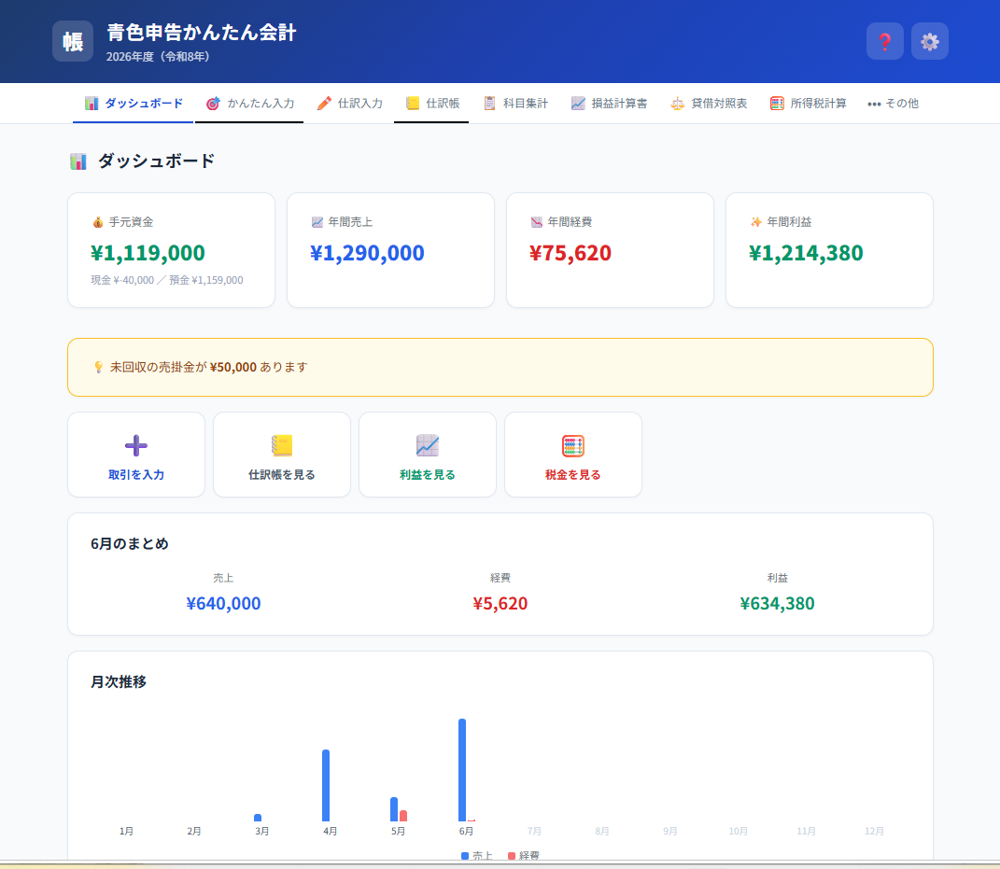
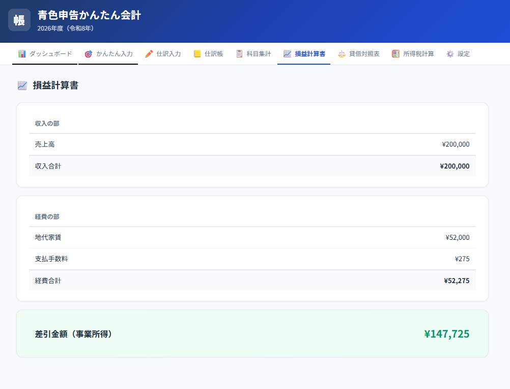

<div align="center">

# 📒 青色申告かんたん会計

**個人事業主のための、いちばんシンプルな青色申告アプリ**

freee を開いて 3 秒で閉じたことがある人へ。

[](https://github.com/monday-easy-lab/aoiro-kaikei/actions)
[](LICENSE)

**[▶ デモを試す](https://monday-easy-lab.github.io/aoiro-kaikei/)**

</div>

---

<!-- ダッシュボードのスクリーンショットをここに -->
<!--  -->

## 特徴

🎯 **かんたん入力** — 「売上が入金された」「家賃を払った」を選ぶだけ。借方・貸方は裏側で自動処理  
✏️ **上級者モード** — 複式簿記の仕訳を直接入力。プリセットパターン付き  
📈 **損益計算書・貸借対照表** — 期首・期末残高対応、青色申告決算書の様式に準拠  
🧮 **所得税シミュレーション** — 令和7年度の基礎控除改正（58〜95万円）に対応済み  
📅 **年度締め** — 元入金の繰越計算を自動化（事業主貸・借の振替含む）  
🔒 **完全オフライン** — データはブラウザの localStorage のみ。サーバー送信ゼロ

<!-- 機能のスクリーンショットをここに（2列レイアウト推奨） -->
<!--
| かんたん入力 | 所得税計算 |
|:---:|:---:|
|  |  |
-->

## クイックスタート

```bash
git clone https://github.com/monday-easy-lab/aoiro-kaikei.git
cd aoiro-kaikei
npm install
npm run dev
```

ブラウザで http://localhost:5173 を開いてください。

## コマンド

| コマンド | 内容 |
|---|---|
| `npm run dev` | 開発サーバー起動 |
| `npm run build` | 本番ビルド（`dist/` に出力） |
| `npm test` | テスト実行（Vitest） |
| `npm run test:watch` | テストをウォッチモードで実行 |

## テスト

会計ロジックの純関数（`calcPL` / `calcBalances` / `closeYear` / 税額計算）に 30 件のユニットテストがあります。

```
✓ calcPL — 売上・経費・利益、返品、資産振替の非影響
✓ calcBalances — 残高計算、期首残高からの継続、貸借等式の検証
✓ closeYear — 翌期元入金、赤字時の減少、ゼロ残高の省略
✓ basicDeductionIncomeTax — 令和6年以前/7・8年/9年以後の段階的控除
✓ calcIncomeTax — 速算表の各ブラケットと境界値
✓ 統合テスト — フリーランス1年間シナリオ（PL整合性・BS貸借一致・年度締め）
```

## 技術スタック

| 用途 | 技術 |
|---|---|
| UI | React 18 |
| ビルド | Vite |
| CSV処理 | PapaParse |
| テスト | Vitest |
| データ保存 | localStorage |
| デプロイ | GitHub Pages（GitHub Actions で自動） |

## プロジェクト構成

```
src/
├── main.jsx                # エントリーポイント
├── App.jsx                 # タブ管理・状態管理
├── styles.js               # テーマ・スタイル定数
├── lib/
│   ├── accounts.js         # 勘定科目定義（23経費科目＋固定資産）
│   ├── calc.js             # PL/BS/税額の純関数
│   ├── storage.js          # localStorage ラッパー
│   └── csv.js              # CSV/JSONのインポート・エクスポート
├── __tests__/
│   └── calc.test.js        # ユニットテスト（30件）
└── components/
    ├── ui.jsx              # SectionTitle, DashCard, ConfirmModal
    ├── Dashboard.jsx       # 月次推移チャート・サマリー
    ├── EasyEntry.jsx       # かんたん入力（テンプレート選択式）
    ├── JournalEntry.jsx    # 仕訳入力（上級者向け）
    ├── Ledger.jsx          # 仕訳帳（検索・編集・削除）
    ├── AccountSummary.jsx  # 勘定科目別集計
    ├── ProfitLoss.jsx      # 損益計算書
    ├── BalanceSheet.jsx    # 貸借対照表（期首・期末）
    ├── TaxCalc.jsx         # 所得税・住民税の概算
    └── SettingsPage.jsx    # 設定・年度締め・データ管理
```

## GitHub Pages へのデプロイ

このリポジトリは push するだけで自動デプロイされます。

1. GitHub でリポジトリの **Settings → Pages → Source** を **GitHub Actions** に設定
2. `main` ブランチに push
3. Actions がテスト → ビルド → デプロイを実行
4. `https://monday-easy-lab.github.io/aoiro-kaikei/` で公開

> **Note:** リポジトリ名を変更した場合は `vite.config.js` の `base` も合わせてください。

## ⚠ 注意事項

<details>
<summary><strong>税理士監修ではありません</strong></summary>

本ソフトは簡易的な会計補助ツールであり、税理士の監修を受けていません。
確定申告書の提出前には、必ず税理士にご確認ください。
</details>

<details>
<summary><strong>データの保存について</strong></summary>

- データはブラウザの `localStorage` に保存されます（**サーバーには一切送信されません**）
- ブラウザのデータを消去するとデータも消えます
- 別の端末・ブラウザからはアクセスできません
- **定期的にJSONバックアップを取ることを強く推奨します**
- 端末を他者と共有する場合、データが閲覧可能な点にご注意ください
</details>

<details>
<summary><strong>税額計算の前提</strong></summary>

- 所得税の基礎控除は**令和7年度税制改正**に対応（令和6年以前: 48万 / 令和7・8年: 58〜95万 / 令和9年以後: 58万）
- 住民税は基礎控除43万円（所得税と異なる）で別計算
- 均等割は 5,000円（道府県1,000 + 市町村3,000 + 森林環境税1,000）で概算
- **未対応の控除:** 社会保険料、生命保険料、配偶者、扶養、医療費、小規模企業共済等
- 個人事業税、消費税・インボイスは対象外
- 対象は個人事業主（事業所得）のみ。不動産所得・給与所得との損益通算は非対応
</details>

## ライセンス

[MIT](LICENSE)

---

<div align="center">
<sub>確定申告は自己責任で行い、必要に応じて税理士に相談してください。</sub>
</div>
